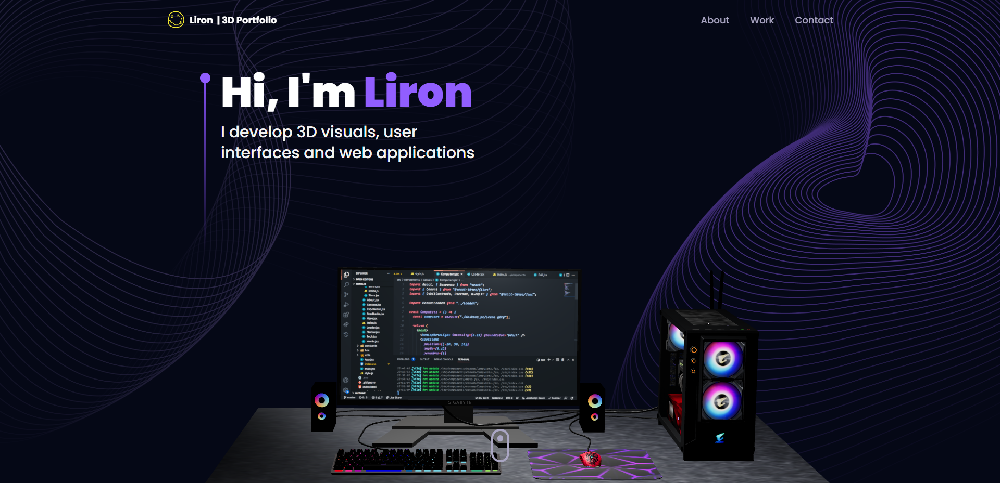

# Abhinav Singh - 3D Portfolio



## 🌐 Live Demo

Explore the live demonstration of the project:
[Abhinav's 3D Portfolio](#) *(Add your Vercel/Netlify link here once deployed!)*

## 📝 Description

**Abhinav's 3D Portfolio** is a well-designed and fully functional portfolio website built with React.js and Three.js. It highlights my journey, skills, projects, and certifications in a highly interactive 3D environment.

### 👨‍💻 About Me
**Passionate | Hustler | Dreamer**

I am a knowledgeable Computer Science student at Lovely Professional University, talented at learning quickly and adding immediate value to any team. I have a strong history of delivering successful full-stack projects by combining technical skills with effective leadership, communication, and teamwork. 

My solid academic achievements are paired with a demonstrated commitment, integrity, and hands-on expertise in technologies like React, Node.js, Three.js, and MongoDB databases. I am driven by the desire to collaborate and create efficient, scalable, and user-friendly solutions that solve real-world problems.

## ✨ Technologies Used

- **React.js & Vite**: For an ultra-fast frontend experience.
- **Three.js & React Three Fiber**: For rendering interactive 3D models (like the Desktop PC and Earth).
- **Tailwind CSS**: For clean, utility-first styling.
- **Framer Motion**: For beautiful scroll animations and transitions.
- **EmailJS**: For the functional contact form.

## 🧰 Get Started

To get this project up and running in your development environment, follow these step-by-step instructions.

### 📋 Prerequisites

- [Node.js](https://nodejs.org/en/)
- [NPM](https://www.npmjs.com/get-npm)
- [Git](https://git-scm.com/downloads)

### ⚙️ Installation and Run Locally

**Step 1:** Install dependencies:
```bash
npm install
```

**Step 2:** Run the development server locally:
```bash
npm run dev
```

**Step 3:** Open `http://localhost:5173` with your browser to see the result.

## 🔒 Environment Variables

To make the Contact Form work, you need to create an account on [EmailJS](https://www.emailjs.com/) and get the required credentials.

Create a `.env` file in the root directory of the project and add the following:

```env
VITE_EMAILJS_SERVICE_ID=<VITE_EMAILJS_SERVICE_ID>
VITE_EMAILJS_TEMPLATE_ID=<VITE_EMAILJS_TEMPLATE_ID>
VITE_EMAIL_JS_ACCESS_TOKEN=<VITE_EMAIL_JS_ACCESS_TOKEN>
```

## 📞 Contact Me

- **LinkedIn**: [Abhinav Singh](https://www.linkedin.com/in/abhinav-singh-124791322)
- **GitHub**: [abhi940927](https://github.com/abhi940927)
- **Instagram**: [abhi_sanatani22](https://instagram.com/abhi_sanatani22)
- **Email**: [abhisingh940927@gmail.com](mailto:abhisingh940927@gmail.com)
